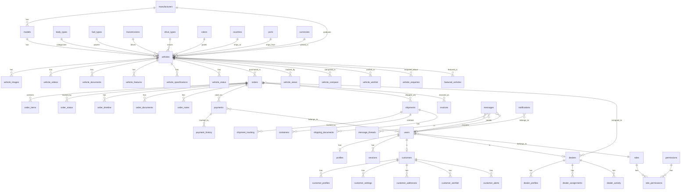

# ZafAutos Japan — Backend Architecture

## Database Tables (48 total)

### Authentication & Users
| Table | Purpose |
|-------|---------|
| `users` | Core user records with role enum |
| `profiles` | User display info (name, phone, avatar) |
| `sessions` | Server-side session tracking |
| `roles` | Role definitions (super_admin, admin, dealer, customer) |
| `permissions` | Granular permission slugs |
| `role_permissions` | Many-to-many role↔permission |

### Vehicles
| Table | Purpose |
|-------|---------|
| `vehicles` | Core vehicle listing |
| `vehicle_images` | Photo gallery per vehicle |
| `vehicle_videos` | Video links |
| `vehicle_documents` | PDFs, inspection reports |
| `vehicle_features` | Feature list (ABS, Airbags, etc.) |
| `vehicle_specifications` | Key-value spec pairs |
| `vehicle_status` | Status history log |

### Reference Data
| Table | Purpose |
|-------|---------|
| `manufacturers` | Make/brand (Toyota, Honda, etc.) |
| `models` | Model per manufacturer |
| `body_types` | Sedan, SUV, Hatchback, etc. |
| `fuel_types` | Petrol, Diesel, Hybrid, etc. |
| `transmissions` | Automatic, Manual, CVT |
| `drive_types` | FWD, RWD, AWD |
| `colors` | Color names |
| `countries` | Destination countries |
| `ports` | Shipping ports |
| `currencies` | USD, JPY, KES |
| `exchange_rates` | Currency conversion rates |

### Customers
| Table | Purpose |
|-------|---------|
| `customers` | Customer record (linked to users) |
| `customer_profiles` | Display name, preferences |
| `customer_settings` | JSON preferences |
| `customer_addresses` | Shipping/billing addresses |
| `customer_wishlist` | Saved vehicles |
| `customer_alerts` | Search alerts |

### Dealers
| Table | Purpose |
|-------|---------|
| `dealers` | Dealer record (linked to users) |
| `dealer_profiles` | Business name, info |
| `dealer_assignments` | Order↔dealer mapping |
| `dealer_activity` | Activity log |

### Orders & Commerce
| Table | Purpose |
|-------|---------|
| `orders` | Purchase orders |
| `order_items` | Line items per order |
| `order_status` | Status history |
| `order_timeline` | Event timeline |
| `order_documents` | Attached files |
| `order_notes` | Internal notes |

### Payments
| Table | Purpose |
|-------|---------|
| `payments` | Payment records |
| `payment_history` | Status change log |
| `payment_methods` | Saved payment methods |
| `invoices` | Invoice records |

### Shipping
| Table | Purpose |
|-------|---------|
| `shipments` | Shipment records |
| `shipment_tracking` | Location/status updates |
| `containers` | Container assignments |
| `shipping_documents` | B/L, packing lists |

### Communications
| Table | Purpose |
|-------|---------|
| `messages` | Direct messages |
| `message_threads` | Conversation threads |
| `notifications` | Push/in-app notifications |
| `email_logs` | Email delivery log |

### Documents
| Table | Purpose |
|-------|---------|
| `documents` | General document storage |
| `document_categories` | Category labels |
| `document_versions` | Version history |

### Marketplace Engagement
| Table | Purpose |
|-------|---------|
| `featured_vehicles` | Homepage featured list |
| `vehicle_views` | View tracking |
| `vehicle_compare` | Comparison lists |
| `vehicle_wishlist` | User wishlists |
| `vehicle_enquiries` | Enquiry submissions |

### Analytics
| Table | Purpose |
|-------|---------|
| `analytics_events` | Custom events |
| `page_views` | Page visit tracking |
| `search_history` | Search query log |

### Settings
| Table | Purpose |
|-------|---------|
| `site_settings` | Key-value site config |
| `system_settings` | Key-value system config |
| `email_templates` | Email template store |
| `languages` | Language codes |

## ER Diagram (Mermaid)

